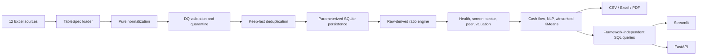

# Production Delivery Report

## 1. Dataset Inventory Table

Counts are measured from the supplied workbooks and the default
`orphan_policy=quarantine` run.

| Dataset | Rows in | Rows loaded | Primary key | Company FK | Header | Year handling |
|---|---:|---:|---|---|---:|---|
| companies | 92 | 92 | `company_id` | No | 1 | None |
| profit_and_loss | 1,276 | 1,073 | `(company_id, year)` | Yes | 1 | Fiscal `YYYY-MM`; TTM rejected |
| balance_sheet | 1,312 | 1,140 | `(company_id, year)` | Yes | 1 | Fiscal `YYYY-MM`; partial flagged |
| cash_flow | 1,187 | 1,056 | `(company_id, year)` | Yes | 1 | Fiscal `YYYY-MM` |
| analysis | 20 | 16 | `source_id` | Yes | 1 | None |
| documents | 1,585 | 1,456 | `(company_id, year)` | Yes | 1 | Calendar integer |
| pros_and_cons | 16 | 14 | `source_id` | Yes | 1 | None |
| sectors | 92 | 92 | `company_id` | Yes | 0 | None |
| market_cap | 552 | 552 | `(company_id, year)` | Yes | 0 | Calendar integer |
| stock_prices | 5,520 | 5,520 | `(company_id, date)` | Yes | 0 | ISO date |
| financial_ratios_reference | 1,184 | 1,041 | `(company_id, year)` | Yes | 0 | Fiscal `YYYY-MM` |
| peer_groups | 56 | 56 | `(peer_group_name, company_id)` | Yes | 0 | None |

The total is 12,892 source rows and 12,108 retained rows. P&L retains all 92 master
companies; balance sheet and cash flow each retain 91. The observed taxonomy has
10 broad sectors and 11 peer groups.

## 2. Source-to-Target Data Mapping

| Target | Source path | Key renames | Critical fields | Positivity rule |
|---|---|---|---|---|
| companies | `data/raw/companies.xlsx` | `id -> company_id` | ticker, company name | face value positive warning |
| profit_and_loss | `data/raw/profitandloss.xlsx` | `id -> source_id` | ticker, fiscal year, sales, PAT | sales/expenses/depreciation non-negative warning |
| balance_sheet | `data/raw/balancesheet.xlsx` | `id -> source_id` | ticker, fiscal year, assets/liabilities | assets positive warning |
| cash_flow | `data/raw/cashflow.xlsx` | `id -> source_id` | ticker, fiscal year | signs allowed |
| analysis | `data/raw/analysis.xlsx` | `id -> source_id` | source ID, ticker | not applicable |
| documents | `data/raw/documents.xlsx` | `Year -> year`, `Annual_Report -> annual_report` | ticker, calendar year | URL warning |
| pros_and_cons | `data/raw/prosandcons.xlsx` | `id -> source_id` | source ID, ticker | not applicable |
| sectors | `data/supporting/sectors.xlsx` | `id -> source_id` | ticker, broad/sub sector | index weight non-negative warning |
| market_cap | `data/supporting/market_cap.xlsx` | `id -> source_id` | ticker, calendar year, market cap | market/enterprise value positive warning |
| stock_prices | `data/supporting/stock_prices.xlsx` | `id -> source_id` | ticker, date, close | OHLCV positive warning |
| financial_ratios_reference | `data/supporting/financial_ratios.xlsx` | `id -> source_id` | ticker, fiscal year | cross-check only |
| peer_groups | `data/supporting/peer_groups.xlsx` | `id -> source_id` | group, ticker, benchmark flag | not applicable |

This mapping is executable in `src/config/tables.py`; no dataset-specific loader
branch is required.

## 3. Target SQLite Data Model

```mermaid
erDiagram
    COMPANIES ||--o{ PROFIT_AND_LOSS : has
    COMPANIES ||--o{ BALANCE_SHEET : has
    COMPANIES ||--o{ CASH_FLOW : has
    COMPANIES ||--o{ DOCUMENTS : publishes
    COMPANIES ||--|| SECTORS : classified_as
    COMPANIES ||--o{ MARKET_CAP : valued_by
    COMPANIES ||--o{ STOCK_PRICES : priced_by
    COMPANIES ||--o{ FINANCIAL_RATIOS_REFERENCE : cross_checks
    COMPANIES ||--o{ PEER_GROUPS : belongs_to
    COMPANIES ||--o{ COMPUTED_RATIOS : derives
    COMPANIES ||--|| HEALTH_SCORES : scored_by
    COMPANIES ||--|| VALUATION_SUMMARY : valued_as
    COMPANIES ||--|| CASHFLOW_INTELLIGENCE : assessed_by
    COMPANIES ||--|| CLUSTER_LABELS : segmented_by
    COMPANIES ||--o{ PEER_PERCENTILES : ranked_by
    SECTORS ||--|| SECTOR_BENCHMARKS : aggregates_to

    COMPANIES {
      text company_id PK
      text company_name
    }
    PROFIT_AND_LOSS {
      text company_id PK,FK
      text year PK
      real sales
      real net_profit
    }
    BALANCE_SHEET {
      text company_id PK,FK
      text year PK
      real total_assets
    }
    CASH_FLOW {
      text company_id PK,FK
      text year PK
      real operating_activity
    }
    COMPUTED_RATIOS {
      text company_id PK,FK
      text year PK
      real return_on_equity_pct
      real free_cash_flow_cr
    }
    HEALTH_SCORES {
      text company_id PK,FK
      real health_score
      text health_band
    }
```



`PRAGMA foreign_keys=ON` is set for every connection. SQL `CHECK` constraints are
limited to critical invariants; positivity remains a warning as required.

## 4. Folder Structure

```text
nifty100-platform/
├── config/                    analytics, screener, and DQ YAML
├── data/{raw,supporting,processed}/
├── src/
│   ├── config/                settings and TableSpec registry
│   ├── common/                logging and exceptions
│   ├── etl/                   loader, validator, normalizer
│   ├── database/              schema and parameterized writer
│   ├── analytics/             ratios, CAGR, score, screen, sector, peer, valuation, cash flow
│   ├── nlp/                   parser and pro/con rules
│   ├── ml/                    winsorised KMeans
│   ├── reports/               PDF and Excel exports
│   ├── dashboard/             SQL data layer and thin Streamlit view
│   ├── api/                   pure queries and FastAPI routes
│   └── orchestration/         staged and full pipeline
├── tests/{etl,analytics,api,integration}/
├── output/
├── reports/{tearsheets,sector}/
├── docs/
├── nifty100.db
├── Makefile
├── pyproject.toml
└── requirements.txt
```

## 5. ETL & Analytics Pipeline Architecture



I/O, pure formulas, and framework wrappers are separate. A new dataset is onboarded
by adding a `TableSpec` plus its schema table.

## 6. Data Quality Rulebook

Observed hits are from the verified quarantine run. Duplicate hits count every row
participating in a duplicate group; rejected-row counts count the rows actually
removed.

| Rule | Field | Severity | Action | Observed hits |
|---|---|---|---|---:|
| DQ001 | company_id | CRITICAL | reject | 0 |
| DQ002 | year/date | CRITICAL | reject | 0 |
| DQ003 | fiscal year | CRITICAL | reject TTM | 100 |
| DQ004 | fiscal year | WARNING | keep + flag partial | 7 |
| DQ005 | fiscal year | INFO | count assumed-March | 55 |
| DQ006 | critical fields | CRITICAL | reject null | 0 |
| DQ007 | company_name | CRITICAL | reject empty | 0 |
| DQ008 | company_id FK | CRITICAL | quarantine | 438 |
| DQ009 | non-negative fields | WARNING | keep + flag | 3 |
| DQ010 | positive fields | WARNING | keep + flag | 1 |
| DQ011 | URLs | WARNING | keep + flag | 351 |
| DQ012 | primary key | WARNING | deduplicate keep-last | 436 |
| DQ013 | normalized type | CRITICAL | reject | 0 |
| DQ014 | statement coverage | WARNING | keep master + flag | 2 |

All events are materialized in `output/validation_failures.csv`.

## 7. Python Code

Implementation-ready modules include `loader.py`, `validator.py`,
`normalizer.py`, `ratio_engine.py`, `health_score.py`, `valuation.py`,
`cashflow_intel.py`, `clustering.py`, `queries.py`, `tearsheet.py`, and
`orchestration/pipeline.py`. Supporting pure formula, CAGR, sector/peer, screener,
NLP, dashboard-data, API, and export modules are included under `src/`.

## 8. schema.sql

`src/database/schema.sql` creates all 12 source tables and analytical tables with
PKs, FKs, critical `NOT NULL`/`CHECK` constraints, and year/company indexes.

## 9. load_audit.csv

`output/load_audit.csv` is generated on every run with table name, input/output
rows, rejected rows, measured runtime, and UTC timestamp. The verified run loaded
12,108 of 12,892 source rows.

## 10. validation_failures.csv

`output/validation_failures.csv` contains table, rule ID, severity, company,
period, field, issue, and action. Default orphan handling quarantined 438 rows
across the affected source files; this represents rows, not distinct tickers.

## 11. Exploratory SQL

`output/exploratory_queries.sql` has 14 runnable statements covering row counts,
nulls, year coverage, missing companies, duplicates, referential integrity,
statement completeness, sector counts, health bands, valuation flags, peer
direction, distress, outliers, and `PRAGMA foreign_key_check`.

## 12. pytest Suite

The suite covers normalizers, DQ and deduplication, every formula edge, all CAGR
flags, eight capital-allocation classes, scoring bands, valuation flags, cash-flow
tiers, peer directions, NLP parsing, API queries/routes, dashboard data, database
integrity, artifacts, and full-universe coverage. `make test` enforces 80% source
coverage and writes `htmlcov/index.html`.

## 13. Risks, Assumptions & Recommendations

1. The master has at least one semantic identifier inconsistency: source ID `ABB`
   is paired with Abbott India metadata and an `ABBOTINDIA` chart link. The
   pipeline preserves the authoritative master key; a governed ticker crosswalk is
   recommended before external use.
2. Eight to nine non-master tickers appear in financial sources. Default quarantine
   protects referential integrity; promote them only after adding governed master
   records.
3. Investing cash flow is the only CapEx-like source field, so the engine uses
   `abs(min(CFI, 0))` as a documented proxy. An explicit fixed-asset purchase line
   would improve FCF precision.
4. No cash balance is supplied. Net debt subtracts investments as the available
   liquid-asset proxy. Add cash/cash-equivalents before using net-debt outputs for
   lending decisions.
5. Simulated calendar-year valuation multiples are not raw-derived. They stay in
   `market_cap` and are joined only for valuation features.
6. Analysis, pros/cons, peer groups, and documents have partial coverage by design.
   Generated narratives cover all 92 companies, but should not be interpreted as
   primary-filing text extraction.
7. Winsorisation limits the effect of INDIGO-like tiny-equity ROE outliers on health
   scores and clusters while preserving the unmodified raw-derived ratio for audit.
